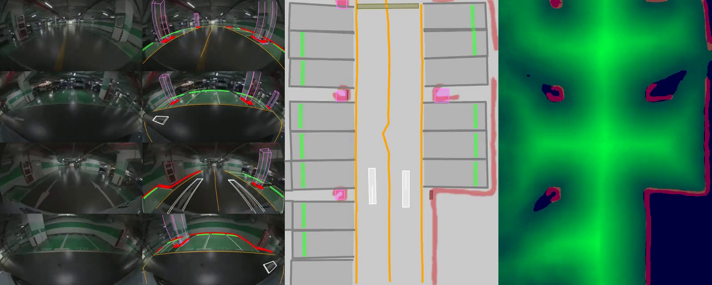
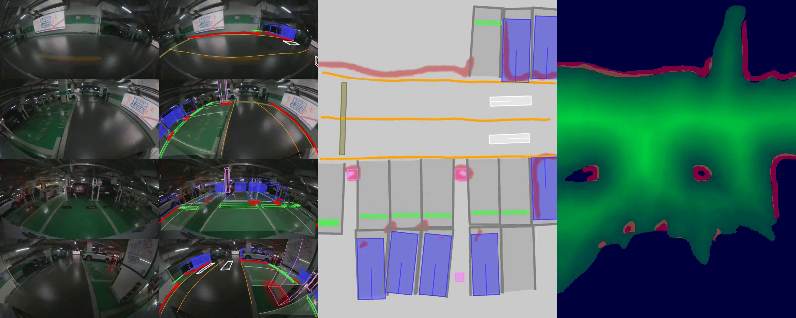

<div align="center">
  
</div>

# 前融合PreFusion




## 训练框架设计
基于mmegine来设计一个直观清晰的前融合框架，易于理解、使用、维护
  - 数据转换：可将其他开源数据转换为pkl格式
  - 数据增强：模块化的数据形态以及增强方法
  - 模型设计：兼容BEV、时空融合、Transformer等技术的模型设计，支持多帧、时序特征输入
  - 任务设计：支持BEV检测、BEV矢量、3D检测、3D语义OCC、端到端轨迹规划任务
  - 指标设计：各个任务的METRIC
  - 推理和部署：易于使用的数据推理以及ONNX部署输出

## 数据转换设计
### 坐标系说明
- ego: 前左上
- box: 前左上
- lidar: 前左上
### 数据转换
详见[pkl_format](docs/pkl_format.md) .

## 快速开始

### 环境安装

强烈建议使用Docker

1. Build from Dockerfile
```bash
docker build -t prefusion:lastest
```

2. Pull from Dockerhub
```bash
docker pull brianlan/prefusion:v11
```

3. Run with docker

```bash
docker run --gpus 0 --privileged --shm-size=32g --rm -it --name prefusion -v /home:/home -v /data:/data brianlan/prefusion:v11 /bin/bash
```


### 训练

#### 数据准备

具体详见`tools/dataset_converters/gene_info_4d_v2.py`

去S3上下载 20231028_145730
`mv-4d-annotation/data/MV4D_12V3L/20231028_145730`
PKL 文件存放在里面

#### 多卡训练
```bash
bash tools/dist_train.sh contrib/fastray_planar/configs/fastray_planar_single_frame_park_apa_scaled_relu6_a800.py 8 --amp
```

### 推理

#### 数据准备
- `tools/dataset_converters/convert_n5_to_pkl.py`
- 下载地址：链接: https://pan.baidu.com/s/1ScN7hsXu_7L1wb-uCntxiA?pwd=gv35 提取码: gv35 
- S3地址`mv-4d-annotation/data/multimodel_data_n5_mvparking_3.0`可以下载别的数据集

#### 单卡推理
- 纯推理
```bash
PYTHONPATH=$(pwd) python tools/infer.py contrib/fastray_planar/configs/infer_n5.py
```
- 模型部署、ONNX导出及DEBUG
```bash
PYTHONPATH=$(pwd) python tools/infer.py contrib/fastray_planar/configs/deploy_debug_n5.py
```

- 带GT的推理
```bash
PYTHONPATH=$(pwd) python tools/infer.py contrib/fastray_planar/configs/infer_with_gt.py
```

## TODO List

- [x] 利用 Gitlab 提供的 CI/CD功能来帮我们跑测试
- [ ] 利用 Gitlab 提供的 docs 功能来帮我们部署文档
